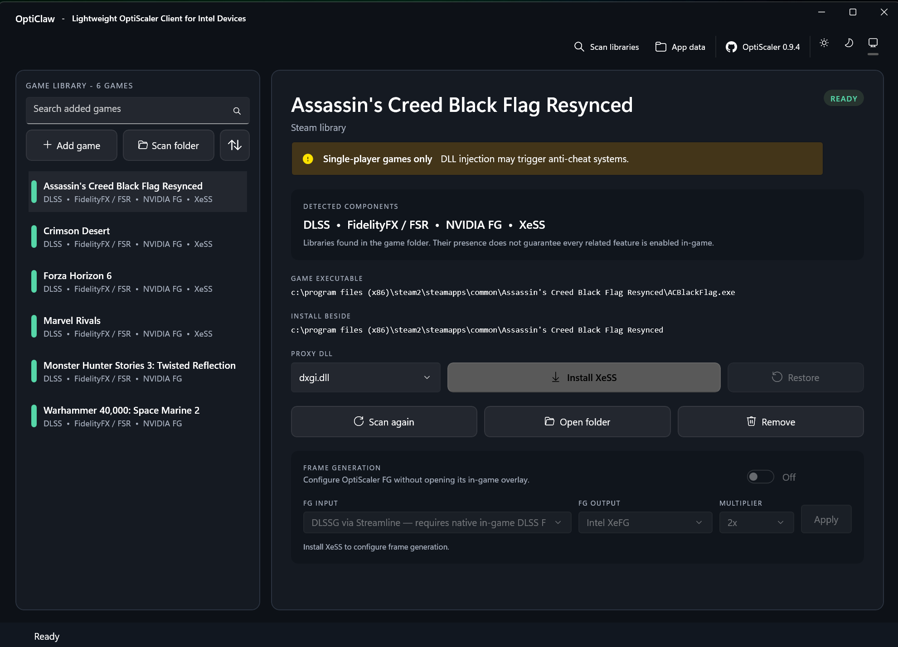

# OptiClaw

OptiClaw is an unofficial [OptiScaler](https://github.com/optiscaler/OptiScaler) client built with WinUI 3. Its touch-friendly interface is designed for Windows handhelds and targeted toward Intel-based MSI Claw devices.



## Features

- Scan Steam, Xbox, or custom game libraries.
- Detect supported upscaling and frame-generation libraries.
- Install and configure OptiScaler with Intel XeSS output.
- Back up changed files and restore the original game folder.

## Usage

1. Install OptiClaw from the Microsoft Store once its listing is available, or build the MSIX package from source.
2. Add a game or scan a library.
3. Select the game and choose **Install XeSS**.
4. Launch the game normally. Press `Insert` to open the OptiScaler overlay.

> [!WARNING]
> OptiClaw is intended for single-player games. DLL injection may trigger anti-cheat systems.

> [!NOTE]
> OptiClaw is not made, endorsed, or supported by the OptiScaler team. OptiScaler is downloaded from its [official GitHub repository](https://github.com/optiscaler/OptiScaler) and verified before installation.

## Build

Requires Windows 10 version 1809 or newer, the .NET 10 SDK, and the Windows 10/11 SDK.

```powershell
dotnet test .\tests\OptiClaw.Core.Tests\OptiClaw.Core.Tests.csproj -c Release
dotnet build .\src\OptiClaw\OptiClaw.csproj -c Release -p:Platform=x64
```

Create an unsigned Store upload package with:

```powershell
.\scripts\build.ps1
```

The output is written to `artifacts\OptiClaw.msixupload`. The manifest contains the Partner Center identity assigned to the OptiClaw Store product.

## Privacy

See the [OptiClaw privacy policy](PRIVACY.md).

## License

OptiClaw is licensed under the [GNU General Public License v3.0 or later](LICENSE). If you distribute OptiClaw or a derivative work, you must make the corresponding source code available to recipients under the GPL's terms. OptiScaler and its bundled libraries retain their own licenses.
